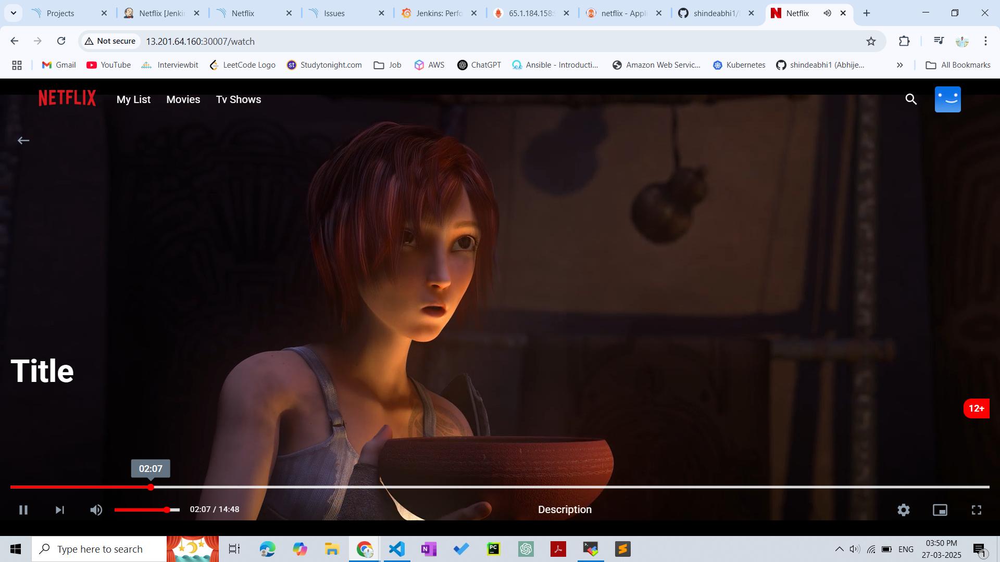

   
  

 

  
  
Home Page

  

   

  

   

  
  
AWS Instance

  
  
Jenkins Full Pipelive Views

  
  
Jenkins Full Stages Views

  
  
Docker Hub Image

  
  
Grafana Monitor

  
  
EKS Monitor

  
  
SonarQube

  
  
Argo CD

